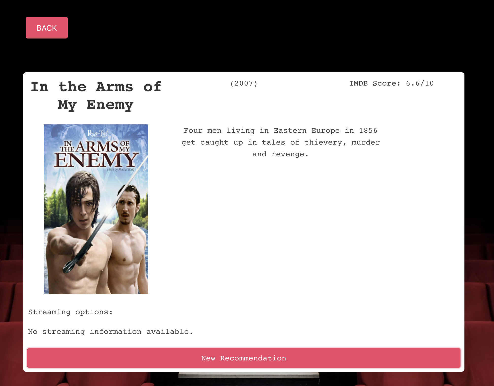
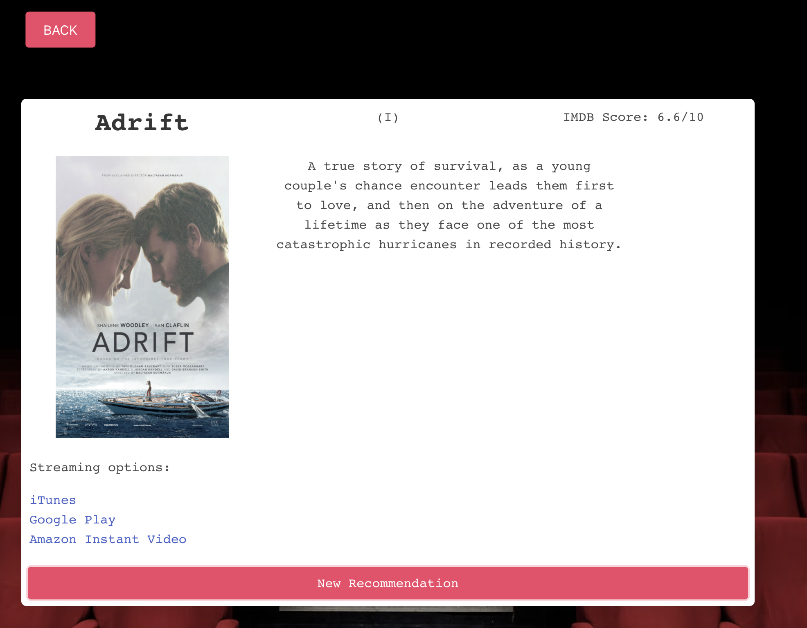

# The Occasional Movie
​
​
## Project Summary
​
A movie recommendation app to suggests films to the user based on their occasion.
​
## Developers
​
1. Blessing Igbadumhe
​
2. Robert Jimenez
​
3. Jessica Sisavath
​
## User Story

    As a user I want to visit a website that will recommend a movie based on my occasion.

## Aceptance Criteria

    WHEN user visits app, THEN they are presented with various options.
    WHEN user submits inputs, THEN a list of movie recommendations is displayed.
    WHEN user clicks on a movie recommendation, THEN user is displayed a movie "card" including a poster, trailer, ratings, synopsis.
    WHEN a card is displayed, THEN links are displayed for where streaming platforms that host that movie.

## Installation Instructions
​
    https://github.com/RJimenezTech/MovieFinder.git

## Web Site link
    https://rjimeneztech.github.io/MovieFinder/

​
​
## Animated Gifs/Pictures of App

​
## Tech Stack
​
    HTML, CSS, JavaScript, Jquery, Bulma(What languages is it written with?)
​
## APIs
​
    IMDB API (https://imdb-api.com/) 
    Utelly API (https://rapidapi.com/utelly/api/utelly/) 
​
## MVP (Minimum Viable Product)
​
    Given a search input from user, display list of movie recommendations
​
​
## Stretch Goals
​
    Given a combination of genres, occasions, age appropriateness, and other inputs, display a list of movie recommendations and links to trailers and availability on streaming services.